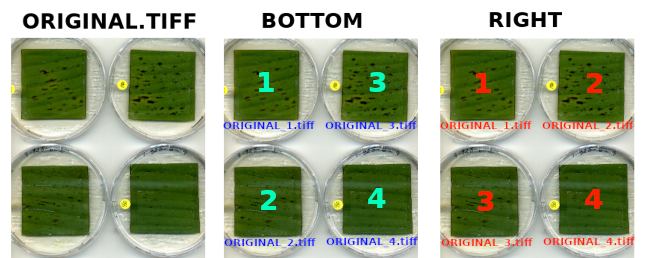

.. image:: Images/LeAFtool-long.png?raw=true
    :target: Images/LeAFtool-long.png?raw=true
    :alt: Alt text
    :width: 100%

.. contents:: Table of Contents
    :depth: 2

About LeAFtool
==============

Research on plant leaf diseases requires the acquisition of quantitative data to characterize the symptoms caused by different pathogens. These symptoms are frequently lesions that are differentiated from the leaf blade by their color and texture. Among the variables used to characterize the impact of a disease, the most relevant are the number of lesions per unit of leaf area, the area and the shape of the lesions. Since visual measurements are only possible on small numbers of images, it is necessary to use computerized image analysis procedures.

Existing procedures can partially meet the needs but are not always adapted to the particularities of the images obtained in the laboratory. From a scanned image under laboratory conditions containing several leaves of plants showing symptoms of a known disease, the algorithm developed makes it possible to obtain for each sheet of the image the number and the characteristics of surface and shape. lesions.

The LeAFtool (Lesion Area Finding tool) is a python script that uses the IPSDK library and also implemented as a macro on the Explorer tool developed by Reactiv'IP.

https://www.reactivip.com/fr/traitement-dimages/#graphic

IPSDK Explorer 3.1; Reactiv’IP; Grenoble, France, 2022; https://www.reactivip.com/

Install
=======

.. code-block:: bash

    cd .local/ReactivIP/Explorer/Macro_Interface/
    git clone https://github.com/sravel/LeAFtool.git

------------------------------------------------------------------------

USAGE
=====

LeAFtool can be used in command line mode, or GUI macro on Explorer

GUI
---
+---------------------------------------+
| Build and Run scripts with interface  +
+=======================================+
|  |build|                              +
+---------------------------------------+

+---------------------------------------+
| Explore results                       +
+=======================================+
|  |explore|                            +
+---------------------------------------+

+---------------------------------------+
| Live Link to images on Explorer       +
+=======================================+
|  |link|                               +
+---------------------------------------+

.. |build| image:: Images/windows.png?raw=true
    :target: Images/windows.png?raw=true
    :alt: Alt text
    :width: 100%

.. |explore| image:: Images/csv.png?raw=true
    :target: Images/csv.png?raw=true
    :alt: Alt text
    :width: 100%

.. |link| image:: Images/explorer.png?raw=true
    :target: Images/explorer.png?raw=true
    :alt: Alt text
    :width: 100%
    :align: middle

CMD
---

Build config.yaml file like:

.. code-block:: yaml

    log_path:
    debug: true
    PLANT_MODEL: banana
    csv_file:
    rename:
    RUNSTEP:
        draw: true
        cut: true
        ML: true
        merge: true
    DRAW-CUT:
        images_path:
        out_cut_dir:
        out_draw_dir:
        extension: tif
        x_pieces: 1
        y_pieces: 1
        top: 0
        left: 0
        right: 0
        bottom: 0
        noise_remove: false
        numbering: Bottom
        force_rerun: false
    ML:
        images_path:
        model_name:
        model_name_classification:
        split_ML: false
        calibration_name:
        small_object: 30
        alpha: 0.8
        color_lesion_individual: true
        leaf_border: 0
        noise_remove: false
        force_rerun: false
        draw_ML_image: true
    MERGE:
        rm_original: false
        extension: jpg

Then run with command line:

.. code-block:: bash

    ~/.local/ReactivIP/Explorer/Macro_Interface/LeAFtool/Leaftool_addons/cmd_LeAFtool.py -c config.yaml

Parameters
==========

RUN STEP
--------

- **draw** *(boolean)*: Active draw tool to see the lines of the border and cutting
- **cut** *(boolean)*: Active cut tool to see the lines of the border and cutting
- **ml** *(boolean)*: Active machine learning tool to see apply model build on Explorer
- **merge** *(boolean)*: Active merge tool to stuck original file to image with classes overlay

Global
------

- **log_path** *(str)*: Directory path where log files will be created
- **debug** *(boolean)*: More verbose logging for errors debug
- **PLANT_MODEL** *(banana/rice)*: Select plante model
- **csv_file** *(str)*: CSV path file with Meta-info, scan name and position mandatory at first and second position. Separator is autodetect
- **rename** *(list)*: ordered list of csv header used to rename cut files

DRAW-CUT
--------

- **images_path** *(str)*: Input path directory with raw scan images
- **out_cut_dir** *(str)*: Output path directory for cut images
- **out_draw_dir** *(str)*: Output path directory for draw images
- **extension** *(jpg/JPG/PNG/png/BMP/bmp/tif/tiff/TIF/TIFF/Tif/Tiff)*: The raw scan images extension, must be the same for all scan.
- **x_pieces** *(int)*: The number of output fragments to split vertically *Default: 1*
- **y_pieces** *(int)*: The number of output fragments to split horizontally *Default: 1*
- **top** *(int)*: The top margin to remove before cut *Default: 0*
- **left** *(int)*: The left margin to remove before cut *Default: 0*
- **bottom** *(int)*: The bottom margin to remove before cut *Default: 0*
- **right** *(int)*: The right margin to remove before cut *Default: 0*
- **noise_remove** *(boolean)*: Use IPSDK unionLinearOpening2dImg function to remove small white objet noise *Default: False*
- **force_rerun** *(boolean)*: Force running again even files existed, rerun draw and/or cut. *Default: False*
- **numbering** *(right/bottom)*: if right: the output order cut is left to right, if bottom: the output order is top to bottom then left *Default: right*

ML
--

- **images_path** *(str)*: Input path directory with cutted scan images
- **model_name** *(int)*: The IPSDK PixelClassification model name build with Explorer
- **model_name_classification** *(int)*: The IPSDK Classification model name build with Explorer
- **split_ML** *(boolean)*: Use machine learning to split leaves instead of RGB *Default: False*
- **calibration_name** *(str)*: Name of Explorer calibration, no calibration if empty
- **small_object** *(int)*: The minimum area of class, to remove small noise detect object *Default: 100*
- **alpha** *(float)*: The degree of transparency to apply for overlay color labels. Must float 0 <= alpha <= 1 *Default: 0.5*
- **color_lesion_individual** *(boolean)*: If `True` apply random color for each separated lesions else use all lesions will colored with color of model *Default: True*
- **leaf_border** *(int)*: The diameter of the brush (in pixels) used to erode the leaf *Default: 0*
- **noise_remove** *(boolean)*: Use IPSDK unionLinearOpening2dImg function to remove small white objet noise *Default: False*
- **force_rerun** *(boolean)*: Force running again even files existed. *Default: False*
- **draw_ML_image** *(boolean)*: If `True`, add overlay rectangle corresponding to image used for apply Machine learning (generally one leaf) *Default: False*

Merge
-----

- **rm_original** *(boolean)*: remove individual files `*_mask_overlay` *Default: False*
- **extension** *(jpg/JPG/PNG/png/BMP/bmp/tif/tiff/TIF/TIFF/Tif/Tiff)*: Merge file extension *Default: jpg*
Examples
========

+------------------------------------------------------+
| 1 class:  lesion, with leaf border                   +
+======================================================+
|  |exemple1|                                          +
+------------------------------------------------------+

+------------------------------------------------------+
| 2 class: lesion and chloroses, without leaf border   +
+======================================================+
|  |exemple2|                                          +
+------------------------------------------------------+

.. |exemple1| image:: Images/banana.jpg?raw=true
    :target: Images/banana.jpg?raw=true
    :alt: Alt text
    :width: 100%

.. |exemple2| image:: Images/2class.jpg?raw=true
    :target: Images/2class.jpg?raw=true
    :alt: Alt text
    :width: 72%

License
=======

Licencied under `CeCill-C <http://www.cecill.info/licences/Licence_CeCILL-C_V1-en.html>`_ and GPLv3.
Intellectual property belongs to `CIRAD <https://www.cirad.fr/>`_ and author.